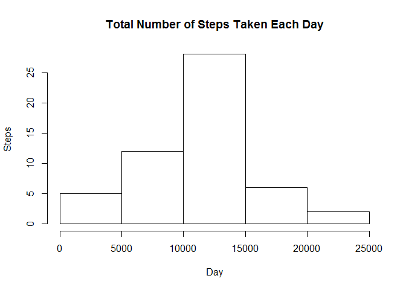

Reproducible Research: Peer Assessment 1
========================================

## Load libraries needed to reproduce research


```r
library(knitr)
library(reshape2)
library(lattice)
```

## Set global options to always display all of the code chunks


```r
opts_chunk$set(echo = TRUE, results = 'asis', warning = TRUE, message = TRUE)
```

## Loading and preprocessing the data

1. Load the data (i.e. read.csv())


```r
if(!file.exists('activity.csv')){
        unzip('activity.zip')
}
activityData <- read.csv('activity.csv', sep=",", header=TRUE, na.strings="NA",
	colClasses=c("numeric", "character", "numeric"))
```

2. Process/transform the data (if necessary) into a format suitable for your analysis

-----

## What is mean total number of steps taken per day?

1. Calculate the total number of steps taken per day (ignoring missing values)


```r
activityDatanoNA <- activityData[!is.na(activityData$steps),]
stepsPerDay <- aggregate(steps ~ date, data = activityDatanoNA, FUN = sum)
```

2a. If you do not understand the difference between a histogram and a barplot, research the difference between them.

Although histograms are made up of bars, they are not bar charts.There are two differences, one is in the type of data that is presented and the other in the way they are drawn. Histograms show distributions, bar charts compare categorical values.

2b. Make a histogram of the total number of steps taken each day


```r
hist(stepsPerDay$steps, xlab = "Day", ylab = "Steps", main = "Total Number of Steps Taken Each Day")
```

 

3. Calculate and report the mean and median total number of steps taken per day


```r
stepsPerDayMean <- mean(stepsPerDay$steps)
stepsPerDayMedian <- median(stepsPerDay$steps)
```

* Mean: 1.0766189\times 10^{4}
* Median:  1.0765\times 10^{4}

-----

## What is the average daily activity pattern?

1. Make a time series plot (i.e. type = "l") of the 5-minute interval (x-axis) and the average number of steps taken, averaged across all days (y-axis)


```r
stepsByInterval <- aggregate(steps ~ interval, data = activityDatanoNA,
                             FUN = mean)
plot(stepsByInterval, type="l")
```

 

2. Which 5-minute interval, on average across all the days in the dataset, contains the maximum number of steps?


```r
maxSteps <- stepsByInterval$interval[which.max(stepsByInterval$steps)]
```

* Max steps of 5-minute interval: 835

-----

## Imputing missing values

Note that there are a number of days/intervals where there are missing values (coded as NA). The presence of missing days may introduce bias into some calculations or summaries of the data.

1. Calculate and report the total number of missing values in the dataset 


```r
stepsMissingValues <- length(which(is.na(activityData$steps)))
```

* Number of missing values: 2304

2. Devise a strategy for filling in all of the missing values in the dataset. The strategy does not need to be sophisticated. For example, you could use the mean/median for that day, or the mean for that 5-minute interval, etc.
3. Create a new dataset that is equal to the original dataset but with the missing data filled in.


```r
stepsPerDay <- aggregate(steps ~ date, data = activityData, FUN = sum)
activityDataFilled <- merge(activityData, stepsPerDay, by="date",
                            suffixes=c("",".new"))
naSteps <- is.na(activityDataFilled$steps)
activityDataFilled$steps[naSteps] <- activityDataFilled$steps.new[naSteps]
activityDataFilled <- activityDataFilled[,1:3]
```

4. Make a histogram of the total number of steps taken each day and Calculate and report the mean and median total number of steps taken per day. Do these values differ from the estimates from the first part of the assignment? What is the impact of imputing missing data on the estimates of the total daily number of steps?


```r
stepsPerDay <- aggregate(steps ~ date, data = activityDataFilled, FUN = sum)
hist(stepsPerDay$steps, xlab = "Day", ylab = "Steps", main = "Total Number of Steps Taken Each Day")
```

 


```r
stepsPerDayMean <- mean(stepsPerDay$steps)
stepsPerDayMedian <- median(stepsPerDay$steps)
```

* Mean filling NA: 1.0766189\times 10^{4}
* Median filling NA:  1.0765\times 10^{4}

Do these values differ from the estimates from the first part of the assignment?  
*There is no difference from the estimates on the first part*

What is the impact of imputing missing data on the estimates of the total daily number of steps?  
*The impact of imputing the missing data is minimal to none*

-----

## Are there differences in activity patterns between weekdays and weekends?

For this part the weekdays() function may be of some help here. Use the dataset with the filled-in missing values for this part.

1. Create a new factor variable in the dataset with two levels – “weekday” and “weekend” indicating whether a given date is a weekday or weekend day.


```r
dayOfWeek <- function(date) {
        if(weekdays(as.Date(date)) %in% c("Saturday", "Sunday")) {
		day <- "Weekend"
	} else {
		day <- "Weekday"
	}
}
activityDataFilled$dayOfWeek <- as.factor(sapply(activityDataFilled$date,
                                                 dayOfWeek))
```

2. Make a panel plot containing a time series plot (i.e. type = "l") of the 5-minute interval (x-axis) and the average number of steps taken, averaged across all weekday days or weekend days (y-axis). See the README file in the GitHub repository to see an example of what this plot should look like using simulated data.


```r
meltSteps <- melt(activityDataFilled, measure.vars="steps")
meanSteps <- dcast(meltSteps, dayOfWeek + interval ~ variable, mean)
xyplot(steps ~ interval | dayOfWeek,
        data=meanSteps,
	xlab="Interval",
	ylab="Number of steps",
	type="l",
	layout=c(1,2)
)
```

 

-----
